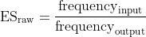
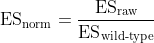

# Enrichment scores for _WT1_ exon 5 data


Here I explain the code in [001\_wt1\_dataset\_es.R](./001_wt1_dataset_es.R), where I process the _WT1_ exon 5 mutagenesis dataset from [Ke et al., 2018](http://dx.doi.org/10.1101/gr.219683.116) to obtain variant enrichment scores.

Unless stated otherwise, all of the code in this document is written in R.


## 1. Load sequence data

First extract sequence information about each of the variants existing in this dataset.

```r
library(readxl)

Ke.Data <- read_xlsx(path = "Data/Ke_2018.xlsx")

# add a code for the WT sequences
Ke.Data$`base change(s)`[which(is.na(Ke.Data$`base change(s)`))] <- "W"
Ke.Data$`SBS / DBS`[which(is.na(Ke.Data$`SBS / DBS`))] <- "W"

# create an ID for each sequence
Ke.Data$ID <- apply(X = Ke.Data[,c("Position","base change(s)")],
                    MARGIN = 1,
                    FUN = function(x){
                      paste(x, sep = "_", collapse = "_")
                    })

# only interested in the exon itself, so remove flanking sequences
Ke.Data$Trimmed.Sequence <- sapply(X = as.character(Ke.Data$Sequence),
                                   FUN = function(x){
                                     substr(x = x, start = 25, stop = 71)
                                   })

# remove duplicated sequences because there is no way for me to know
# which hexamer (experiment) they come from
Ke.Data <- Ke.Data[-which(duplicated(Ke.Data$Trimmed.Sequence)),]
```


## 2. Load count data

Next, extract pre-selection ("input") and post-selection ("output") count data for each of the variants above.

```r
#input replicates
Input.1 <- setNames(read.table("Data/GSM2828190_InputRep1_WTSMseq_rawcounts.txt.gz"),
                    c("sequence", "counts"))
Input.1 <- Input.1[-which(duplicated(Input.1$sequence)),]
rownames(Input.1) <- as.character(Input.1$sequence)
Ke.Data$Input.1 <- Input.1[as.character(Ke.Data$Trimmed.Sequence),"counts"]

Input.2 <- setNames(read.table("Data/GSM2828191_InputRep2_WTSMseq_rawcounts.txt.gz"),
                    c("sequence", "counts"))
Input.2 <- Input.2[-which(duplicated(Input.2$sequence)),]
rownames(Input.2) <- as.character(Input.2$sequence)
Ke.Data$Input.2 <- Input.2[as.character(Ke.Data$Trimmed.Sequence),"counts"]

Input.3 <- setNames(read.table("Data/GSM2828192_InputRep3_WTSMseq_rawcounts.txt.gz"),
                    c("sequence", "counts"))
Input.3 <- Input.3[-which(duplicated(Input.3$sequence)),]
rownames(Input.3) <- as.character(Input.3$sequence)
Ke.Data$Input.3 <- Input.3[as.character(Ke.Data$Trimmed.Sequence),"counts"]

Input.4 <- setNames(read.table("Data/GSM2828193_InputRep4_WTSMseq_rawcounts.txt.gz"),
                    c("sequence", "counts"))
Input.4 <- Input.4[-which(duplicated(Input.4$sequence)),]
rownames(Input.4) <- as.character(Input.4$sequence)
Ke.Data$Input.4 <- Input.4[as.character(Ke.Data$Trimmed.Sequence),"counts"]

# each input replicate is not linked to any particular output replicate, so they can
# be considered as technical replicates and can therefore be combined together
Ke.Data$Total.Input <- Ke.Data$Input.1 + Ke.Data$Input.2 + Ke.Data$Input.3 + Ke.Data$Input.4

# output replicates
Output.1 <- setNames(read.table("Data/GSM2828194_OutputRep1_WTSMseq_rawcounts.txt.gz"),
                     c("sequence", "counts"))
Output.1 <- Output.1[-which(duplicated(Output.1$sequence)),]
rownames(Output.1) <- as.character(Output.1$sequence)
Ke.Data$Output.1 <- Output.1[as.character(Ke.Data$Trimmed.Sequence),"counts"]

Output.2 <- setNames(read.table("Data/GSM2828195_OutputRep2_WTSMseq_rawcounts.txt.gz"),
                     c("sequence", "counts"))
Output.2 <- Output.2[-which(duplicated(Output.2$sequence)),]
rownames(Output.2) <- as.character(Output.2$sequence)
Ke.Data$Output.2 <- Output.2[as.character(Ke.Data$Trimmed.Sequence),"counts"]

Output.3 <- setNames(read.table("Data/GSM2828196_OutputRep3_WTSMseq_rawcounts.txt.gz"),
                     c("sequence", "counts"))
Output.3 <- Output.3[-which(duplicated(Output.3$sequence)),]
rownames(Output.3) <- as.character(Output.3$sequence)
Ke.Data$Output.3 <- Output.3[as.character(Ke.Data$Trimmed.Sequence),"counts"]
```


## 3. Raw enrichment scores

For each variant, calculate a raw enrichment score (ES), defined as:

<p align="center">
  
</p>


So calculate the frequency of each variant in the input:

```r
# input frequency
Ke.Data$Input.Frequency <- Ke.Data$Total.Input/sum(Ke.Data$Total.Input)
```

And the frequency of each variant in each output replicate:

```r
# output frequency
count <- 1
for (eachCol in colnames(Ke.Data)[grep(pattern = "Output", x = colnames(Ke.Data))]) {
  Frequency <- Ke.Data[,eachCol]/sum(Ke.Data[,eachCol])
  NewColName <- paste("Output.Frequency.",
                      as.character(count),
                      sep = "")
  Ke.Data[[NewColName]] <- Frequency
  count <- count + 1
}
```

The raw ES is thus the ratio of the numbers calculated in the previous two steps:

```r
# raw enrichment score
count <- 1
for (eachCol in colnames(Ke.Data)[grep(pattern = "Output.Frequency", x = colnames(Ke.Data))]) {
  Raw.ES <- Ke.Data[,eachCol]/Ke.Data[,"Input.Frequency"]
  NewColName <- paste("Raw.ES.",
                      as.character(count),
                      sep = "")
  Ke.Data[[NewColName]] <- Raw.ES
  count <- count + 1
}
```

## Normalised enrichment scores

For each variant, calculate a **normalised** enrichment score, defined as:

<p align="center">
  
</p>

In this experiment, _WT1_ exon 5 was mutagenised 10 different times, each time in the presence of a different hexamer at the start of the exon. We can consider these 10 different experiments, each with its own wild type sequence and enrichment score. Therefore, to make things easier to process and before calculating the normalised enrichment score, we'll split the dataset in 10 according to the hexamer in the exon:

```r
library(dplyr)

Ke.Data.Split.By.Hexamer <- Ke.Data %>%
  group_split(Hexmut)

Ke.Data.Split.By.Hexamer <- lapply(X = Ke.Data.Split.By.Hexamer,
                                   FUN = as.data.frame)
```

And now we can calculate the normalised enrichment scores for each of the 10 experiments:

```r
# calculate normalised enrichment scores + log normalised enrichment scores
for (i in 1:length(Ke.Data.Split.By.Hexamer)) {
  count <- 1
  for (eachCol in colnames(Ke.Data.Split.By.Hexamer[[i]])[grep(pattern = "Raw.ES", x = colnames(Ke.Data.Split.By.Hexamer[[i]]))]) {
    
    Singles.Density <- density(unlist(Ke.Data.Split.By.Hexamer[[i]][which(Ke.Data.Split.By.Hexamer[[i]]$`SBS / DBS`=="S"), eachCol]))
    
    # estimate the wild type enrichment score as the mode of the
    # single mutant enrichment scores (depending on how the experiment was
    # done, this might be a more accurate estimate of the wt ES)
    WT.Score <- Singles.Density$x[which(Singles.Density$y == max(Singles.Density$y))]
    
    Ke.Data.Split.By.Hexamer[[i]][which(Ke.Data.Split.By.Hexamer[[i]]$`SBS / DBS`=="W"), eachCol] <- WT.Score
    
    Normalised.ES <- Ke.Data.Split.By.Hexamer[[i]][,eachCol]/WT.Score
    NewColName <- paste("Normalised.ES.",
                        as.character(count),
                        sep = "")
    Ke.Data.Split.By.Hexamer[[i]][[NewColName]] <- Normalised.ES
    
    Log.Normalised.ES <- log2(Normalised.ES)
    NewColName <- paste("Log.Normalised.ES.",
                        as.character(count),
                        sep = "")
    Ke.Data.Split.By.Hexamer[[i]][[NewColName]] <- Log.Normalised.ES
    
    count <- count + 1
  }
 }
```


## Mean enrichment scores

Finally, calculate the average enrichment score for each variant.

```r
# avg ES
for (i in 1:length(Ke.Data.Split.By.Hexamer)) {

  Ke.Data.Split.By.Hexamer[[i]]$Merged.Normalised.ES <- apply(X = Ke.Data.Split.By.Hexamer[[i]][,c("Normalised.ES.1",
                                                                                                   "Normalised.ES.2",
                                                                                                   "Normalised.ES.3")],
                                                              MARGIN = 1,
                                                              FUN = function(x){
                                                                Idx <- which(x[1:3]>0)
                                                                mean(x[Idx])
                                                              })
  
  Ke.Data.Split.By.Hexamer[[i]]$Log.Merged.Normalised.ES <- log2(Ke.Data.Split.By.Hexamer[[i]]$Merged.Normalised.ES)
      
}
```


## Save data

Save data into an R list and export for later use.

```r
# initialise empty list
Singles.List <- vector(mode = "list",
                       length = length(Ke.Data.Split.By.Hexamer))

# loop through each experiment to fill in the list
for (i in 1:length(Ke.Data.Split.By.Hexamer)) {
  Singles <- Ke.Data.Split.By.Hexamer[[i]][which(Ke.Data.Split.By.Hexamer[[i]]$`SBS / DBS`=="S"),]  
  Singles.List[[i]] <- Singles
 }

# save
save(Singles.List,
     file = "Data/WT1_ES.RData")
```
