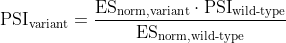
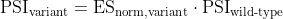
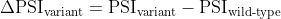

# PSI values for _WT1_ exon 5 data


Here I explain the code in [002\_wt1\_dataset\_psi\_a.R](./002_wt1_dataset_psi_a.R), where I calculate the inclusion level (+ splicing efficiency values) for variants in the _WT1_ exon 5 mutagenesis data.

Unless stated otherwise, all of the code in this document is written in R.


## 1. Load enrichment score data

We calculated ES's for this dataset in the previous step. So just load the dataset:

```r
# get data
load("Data/WT1_ES.RData")
```


## 2. From enrichment scores to ΔPSI & A

We'll now convert the enrichment scores calculated earlier into:

* ΔPSI (changes in exon inclusion)
* A (changes in splicing efficiency)

We can calculate the PSI of a given variant using the following equation:

<p align="center">
  
</p>


and because the normalised ES of the wild-type sequence is, by definition, 1, that equation simplifies to:

<p align="center">
  
</p>

The ΔPSI is then given by:

<p align="center">
  
</p>

The only information that we don't have to calculate this is the PSI of the WT exon. These are given in [Ke et al., 2018](http://dx.doi.org/10.1101/gr.219683.116), so we'll simply manually define them in an R vector:

```r
# psi for the 10 WTs
Ke.WT.PSIs <- c("A" = 7,
                "B" = 20,
                "C" = 65,
                "D" = 0.1,
                "E" = 3,
                "F" = 43,
                "G" = 4,
                "H" = 74,
                "I" = 53,
                "J" = 5)
```

I will calculate the changes in splicing efficiency at the same time as I calculate ΔPSI. These are given by equation 1 in figure 1 of the manuscript. I defined a function that converts the phenotypic effect of a mutation on exon inclusion (ΔPSI) into its biophysical effect on splicing efficiency (A):

```r
# function that converts delta PSI values into delta splicing efficiency A
# (from equation 1 in figure 1)
FromDeltaPsiToA <- function(delta.psi, starting.psi){
  y <- delta.psi
  x <- starting.psi
  A <- (y + x - ((y*x + x^2)/(100)))/(x - ((y*x + x^2)/(100)))
  A
}
```

Now we are ready to calculate this for all variants in the _WT1_ exon 5 dataset:

```r
# loop through the 10 experiments/hexamers/exons in Ke et al 2018
for (i in 1:length(Singles.List)) {
  # the starting PSI is the PSI of the WT
  Singles.List[[i]]$Starting.PSI <- Ke.WT.PSIs[i]
  
  # the final PSI is the PSI after introducing the mutation
  Singles.List[[i]]$Final.PSI <- Singles.List[[i]]$Merged.Normalised.ES * Ke.WT.PSIs[i]
  
  # if we predicted anything to be above 100%, manually set to 100%
  idx <- which(Singles.List[[i]]$Final.PSI > 100)
  if (length(idx)>0){
    Singles.List[[i]]$Final.PSI[idx] <- 100
  }
  
  # if we predicted anything to be below 0%, manually set to 0%
  idx <- which(Singles.List[[i]]$Final.PSI < 0)
  if (length(idx)>0){
    Singles.List[[i]]$Final.PSI[idx] <- 0
  }
  
  # delta PSI
  Singles.List[[i]]$Delta.PSI <- Singles.List[[i]]$Final.PSI - Singles.List[[i]]$Starting.PSI
  
  # delta splicing efficiency
  Singles.List[[i]]$A <- FromDeltaPsiToA(delta.psi = Singles.List[[i]]$Delta.PSI,
                                         starting.psi = Singles.List[[i]]$Starting.PSI)
}
```

## Save

Save these values for plotting etc later on. Will only save hexamers B, C, F, H and I, since these are the ones with an intermediate inclusion level (between 20% and 80%).

```r
# distribution of A values
Ke.A.Distributions.Singles <- list("B" = Singles.List[[2]]$A,
                                   "C" = Singles.List[[3]]$A,
                                   "F" = Singles.List[[6]]$A,
                                   "H" = Singles.List[[8]]$A,
                                   "I" = Singles.List[[9]]$A)

# save
save(Ke.A.Distributions.Singles,
     file = "Data/Ke_A_Distributions.RData")


# save the whole data frames as well just in case
Singles.DFs <- list("B" = Singles.List[[2]],
                    "C" = Singles.List[[3]],
                    "F" = Singles.List[[6]],
                    "H" = Singles.List[[8]],
                    "I" = Singles.List[[9]])

# save
save(Singles.DFs,
     file = "Data/Ke_Singles_DataFrames.RData")
```